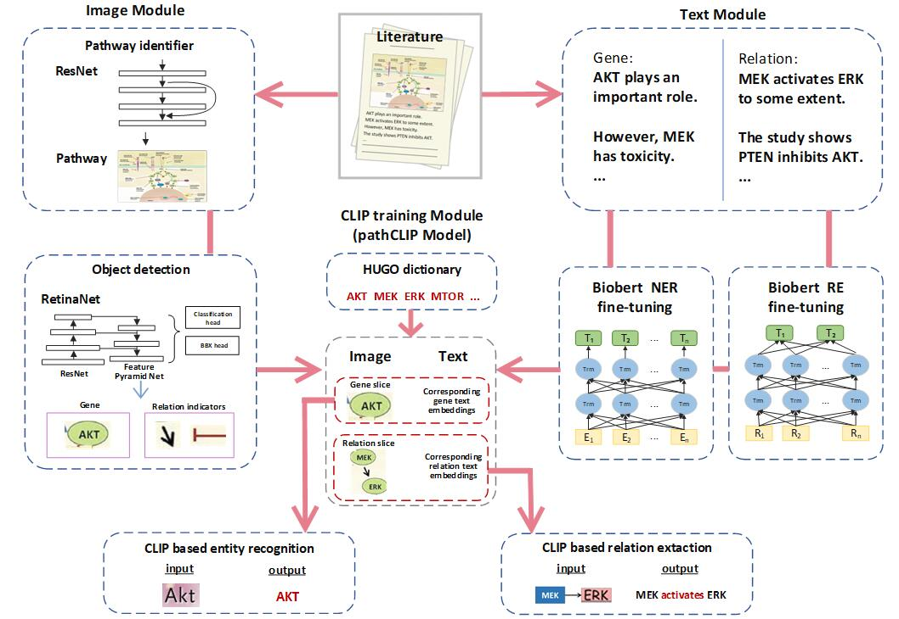

# pathCLIP
Detection of Genes and Gene Relations from Biological Pathway Figures through Image-Text Contrastive Learning


## Abstract
We present a pathway figure curation system named pathCLIP for identifying genes and gene relations from pathway figures. Our key innovation is the use of an image-text contrastive learning model to learn coordinated embeddings of image snippets and text descriptions of genes and gene relations, thereby improving curation. Our validation results, using pathway figures from PubMed, showed that our multimodal model outperforms models using only a single modality. Additionally, our system effectively curates genes and gene relations from multiple literature sources. Two case studies on extracting pathway information from literature of non-small cell lung cancer and Alzheimer’s disease further demonstrate the usefulness of our curated pathway information in enhancing related pathways in the KEGG database.

# Overview of pipeline

We developed pathCLIP, a comprehensive framework designed to extract genes and their relations from biological pathway figures and associated text descriptions, which mainly includes three key components: (1) the image module to extract visual embedding from pathway figures, (2) the text module to generate text embedding from article text, and (3) the image-text contrastive learning module to achieve the tasks of gene entity recognition and relation extraction.

It is a deep learning framework for extracting the relationship between genes in **pathway images** or **PDFs**.

There are two kinds of data testing operation modes: Mode1, Mode2, and both of them can extract the results of gene relationship.

## Profile

**mmocr , config :** mmocr related files and configuration, in order to achieve the purpose of text recognition.

**model:** Our all models used for pathCLIP pipeline. 
(Baidu Netdisk: https://pan.baidu.com/s/1-8bY3t9-DjGHwFJImuEFRw : 4wwb)

**test:** operation for mode1, the folder where the pathway figures are placed. 
(Baidu Netdisk: https://pan.baidu.com/s/1GTgw5HepAigoZfMlN8NCeg : aeo4)

**paper:** operation for mode2, the folder where the PDFs are placed. 
(Baidu Netdisk: https://pan.baidu.com/s/1G63-FTilJq7W40xnulY-4w : 006m)

**retinanet:** pathway identifier configuration.

**exHUGO_latest.json:** gene word bank.

## Data preparation

Mode1：pathway images, place the images in the **test** folder directory. Or you can use the pathway figures we prepared.

The data schema to run our code is as follows :

```
 |__test/
 | |__img/
 | | |__img1.jpg  # The pathway picture you placed
 | | |__img2.jpg  # The pathway picture you placed
 | | |__img3.jpg  # The pathway picture you placed
```

Mode2：PDFs with pathway images, place the PDF in the **paper** folder directory. Or you can use the PDF file we prepared.

The data schema to run our code is as follows :

```
 |__paper/
 | |__paper1.pdf   # PDFs with pathway images
 | |__paper2.pdf   # PDFs with pathway images
 | |__paper3.pdf   # PDFs with pathway images
```

## Testing operation mode

### Mode1

Put the pathway images in the **test** folder and then run **pipeline_hugo.py** 

The result structure generated after the operation is as follows:

 ```
  |__test/
  | |__img/
  | | |__gene_name/
  | | | |__image1_elements.json  # Including the extracted gene information
  | | |__relation/
  | | | |__image1_relation.json  # Including the extracted relationship information
  | | |__relation_subimage/
  | | | |__image1.jpg  # visualize the above results on the graph
  | | |__image1.jpg  # The pathway picture you placed
 ```

### Mode2

Put the PDFs with pathway images in the **paper** folder and run **main.py**

The result structure generated after the operation is as follows:

```
 |__result/  # Newly generated result folder
 | |__pdf_name/  # The file name of the PDF as the folder name
 | | |__img/
 | | | |__gene_name/
 | | | | |__image1_elements.json # Including the extracted gene information
 | | | |__relation/
 | | | | |__image1_relation.json  # Including the extracted relationship information
 | | | |__relation_subimage/
 | | | | |__image1.jpg  # visualize the above results on the graph
 | | | |__image1.jpg  # Pathway pictures extracted from PDF
```


## pathCLIP for relation extraction 
### Training

run **pathCLIP_relation_extraction_train.py**. You can get training image at Baidu Netdisk https://pan.baidu.com/s/17sQpH4sHAgtGRDLRktNSLg
(a407). And you can refer to our organization form of image-text pairs. at Baidu Netdisk https://pan.baidu.com/s/13IW-GE35rLcOmXvEr7_ERg(g5rg)

### Testing

run **pathCLIP_relation_extraction_inference.py**. You can get model at Baidu Netdisk https://pan.baidu.com/s/1tTJeKYwNwNLqlm4C4Mbpdg(lb1i) and get testing dataset at https://pan.baidu.com/s/1sis8BWog3bIRworjMKF8lg(tjvg)

## Update

We may modify the gene bank in the **exHUGO_latest.json** file, and the file will be updated from time to time.
